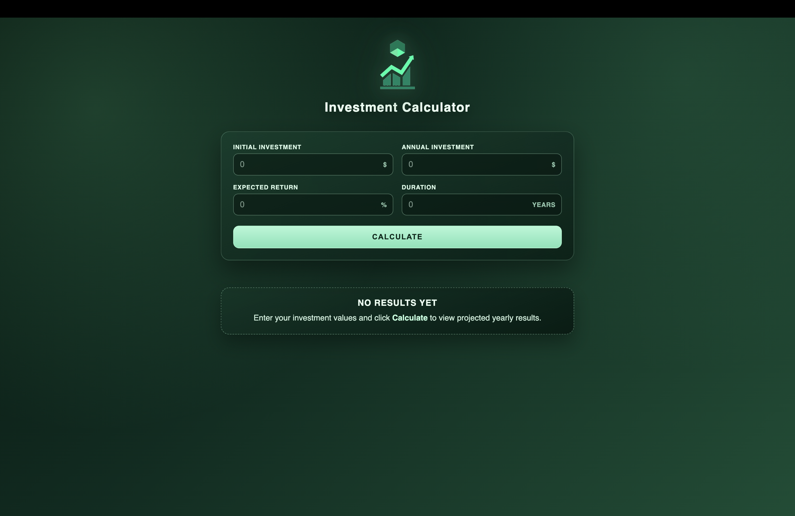
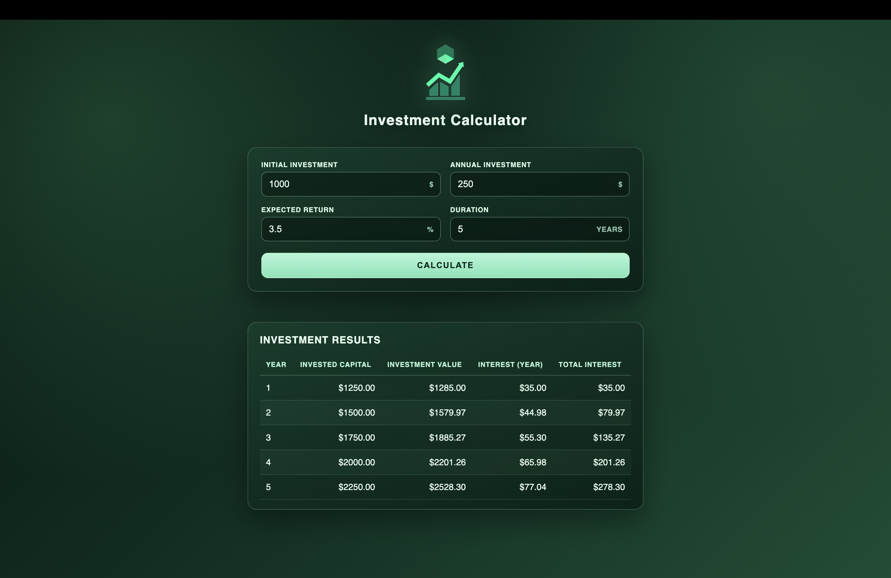

# Investment Calculator

A simple Angular app that projects investment growth over time with a clean dark-green UI.

## Screenshots
### Empty state (before calculation)


### Results state (after calculation)


## How to Run
### Prerequisites
- Node.js 20+ (or latest LTS)
- npm

### Install dependencies
```bash
npm install
```

### Start development server
```bash
npm start
```

Open: `http://localhost:4200/`

### Build for production
```bash
npm run build
```

### Run tests
```bash
npm test
```

## General Logic
The calculator uses yearly compounding with annual contributions:

1. Start with `initialInvestment`.
2. For each year:
   - Calculate yearly interest from current portfolio value:
     - `interestYear = investmentValue * (expectedReturn / 100)`
   - Add interest and annual contribution:
     - `investmentValue += interestYear + annualInvestment`
   - Track invested capital:
     - `investedCapital = initialInvestment + (annualInvestment * year)`
   - Track total earned interest:
     - `totalInterest = investmentValue - investedCapital`
3. Display each year as one row in the results table.

## Main Features
- 4 input fields: initial investment, annual investment, expected return, duration
- Input validation with inline error states
- Empty-state banner when no calculation is submitted yet
- Results table with yearly breakdown
- Responsive layout

## Tech Stack
- Angular 21
- TypeScript
- Template-driven forms (`ngModel`)
